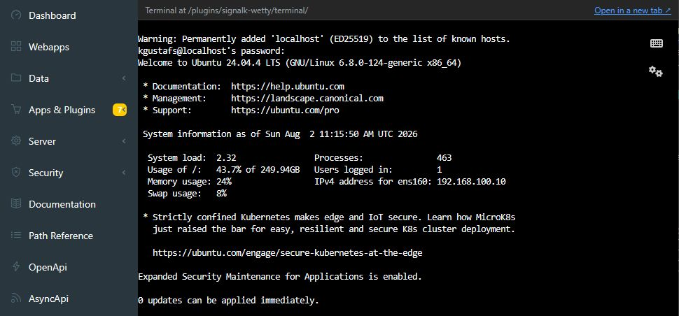

# Signal K WeTTY Terminal

An embedded web terminal for the [Signal K](https://signalk.org) admin UI,
powered by [WeTTY](https://github.com/butlerx/wetty).

The terminal runs with the Signal K plugin and is available from
**Webapps > WeTTY Terminal**. By default it connects to `localhost:22` over
SSH and is only exposed through Signal K.



## Requirements

- Signal K server 2.x
- Node.js 20 or newer
- An SSH server on the configured destination

SSH connections use a built-in JavaScript SSH client — no `ssh` binary needs to
be installed in the machine or container running Signal K, which is what makes
this plugin work out of the box in minimal Docker images. It covers the common
case (host/port/user, password or private-key auth) but does not support
`ssh_config`, ProxyJump/bastion hosts, agent forwarding, or GSSAPI.

SSH is not required when using local mode, but local mode only works when the
Signal K server process runs as root.

## Installation

This package is installed from the repository. Build a tarball, install it in
the Signal K data directory, and restart Signal K:

```sh
git clone https://github.com/KEGustafsson/signalk-wetty.git
cd signalk-wetty
npm install
npm run build
npm pack
cd ~/.signalk
npm install --save /path/to/signalk-wetty/signalk-wetty-0.2.0.tgz
```

Enable **WeTTY Terminal** under **Server > Plugin Config**, then open it from
**Webapps > WeTTY Terminal**.

## Configuration

The defaults work when an SSH server is available on the Signal K host.

| Setting         | Default     | Description                                                     |
| --------------- | ----------- | --------------------------------------------------------------- |
| Connection mode | `ssh`       | Connect through SSH, or use `local` when Signal K runs as root. |
| SSH host        | `localhost` | Host the terminal connects to.                                  |
| SSH port        | `22`        | SSH port on the destination host.                               |
| SSH user        | Empty       | Leave empty to prompt for a username.                           |
| Terminal port   | `3001`      | Internal WeTTY port; it must differ from the Signal K port.     |
| Bind address    | `127.0.0.1` | Keeps the direct WeTTY port private to the Signal K host.       |
| Command         | `login`     | Command started for each terminal session.                      |

Additional options support SSH keys, known hosts, HTTPS, logging, and
URL-selected hosts or commands. Their descriptions are shown in the plugin
configuration page.

## SSH server unavailable

To provide an SSH server on Debian, Ubuntu, Raspberry Pi OS, or OpenPlotter:

```sh
sudo apt install -y openssh-server
sudo systemctl enable --now ssh
```

For a remote SSH host, check its address, port, firewall, and SSH service. The
webapp shows the connection error and provides a **Check again** button, so the
terminal does not need to be reopened after the server becomes available.

## Native node-pty module

WeTTY uses the native `node-pty` module. This repository includes prebuilt
Linux binaries for x64 and arm64 under `native-prebuilds/`. The plugin installs
the matching binary automatically when available.

If no compatible binary is available, use **Rebuild node-pty** in the webapp.
The manual equivalent on Debian-based systems is:

```sh
sudo apt install -y python3 make g++
cd ~/.signalk
npm rebuild node-pty --foreground-scripts
```

Restart the plugin after rebuilding.

Maintainers can build a prebuilt binary on a Linux x64, arm64, or arm host with:

```sh
npm install --include=optional
npm run build:node-pty-prebuild
```

The result is written to `native-prebuilds/linux-<architecture>/pty.node`. The
**Native node-pty prebuilds** GitHub Actions workflow builds Linux x64 and
arm64 binaries and commits them to the repository; it does not publish a
package. There is no hosted 32-bit ARM runner, so a `linux-arm` binary has to
be built on an arm host with the commands above and committed by hand.

## Security

Keep the bind address at `127.0.0.1` unless direct network access to WeTTY is
deliberately required. Setting it to `0.0.0.0` exposes the terminal port
without Signal K authentication.

Leave the SSH password and private key fields empty unless access is protected
by another trusted network boundary. Saved passwords are stored in plugin
configuration, and configured credentials can create passwordless shell access
for anyone who can reach a directly exposed terminal port.

Keep **Allow host/port in the URL** and **Allow command/path in the URL**
disabled, which is the default, whenever the bind address is not `127.0.0.1`.
They let the browser URL choose the SSH `host` and `port`, and the `command` and
`path` run after login, so on a directly exposed terminal port anyone who can
reach it picks both the destination and the command — using the credentials
configured here.

For remote SSH hosts, configure a real `known_hosts` file instead of the default
`/dev/null`.

## Development

```sh
npm install
npm run build
npm test
npm run lint
npm run prettier:check
```

Run `npm run integration` for a smoke test against a temporary real Signal K
server installation.

## License

[MIT](LICENSE)
