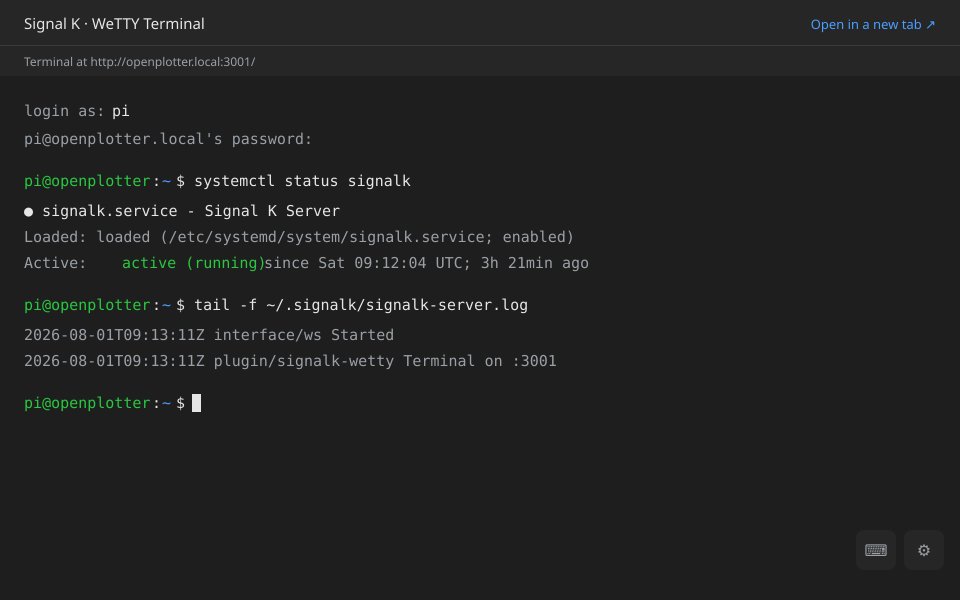

# signalk-wetty

A [Signal K](https://signalk.org) server plugin that embeds
[WeTTY](https://github.com/butlerx/wetty) — a browser terminal built on xterm.js
— and publishes it as a webapp in the Signal K admin UI.

The terminal starts and stops with the plugin, inside the Signal K server
process. There is no separate service to install, no systemd unit and nothing to
keep running: enable the plugin and **Webapps → WeTTY Terminal** appears in the
admin UI.

<p align="center">
  
</p>

## Requirements

|                 |                                                                         |
| --------------- | ----------------------------------------------------------------------- |
| Node.js         | 20 or newer                                                             |
| Signal K server | 2.x                                                                     |
| Build tools     | `python3`, `make`, `g++` — see [Native module](#native-module-node-pty) |
| For SSH mode    | an SSH server on the machine running Signal K                           |

## Install

From the Signal K admin UI: **Appstore → Available**, search for
`signalk-wetty`, install, then enable it under **Server → Plugin Config**.

Or manually, next to your Signal K configuration:

```sh
cd ~/.signalk
npm install signalk-wetty
```

Then restart the server and enable the plugin.

> **After an app store install, read [Native module](#native-module-node-pty)
> first.** The app store installs plugins with `npm install --ignore-scripts`,
> which leaves WeTTY's `node-pty` native module uncompiled. The plugin detects
> this and offers a one-click fix.

## How it works

```text
browser ──▶ Signal K server :3000 ──▶ /signalk-wetty/       the webapp shell
                                 └──▶ /plugins/signalk-wetty/status
                                                     admin-only status route

browser ──▶ WeTTY            :3001 ──▶ ssh ──▶ your shell
```

The plugin runs WeTTY on its own port rather than proxying it through the
Signal K server. WeTTY's terminal traffic is a socket.io connection that upgrades
to a WebSocket, and proxying that would mean attaching to the Signal K server's
HTTP server — an internal the plugin API deliberately does not expose. Keeping
WeTTY on its own listener is the supported way to do this, at the cost of one
extra port.

The webapp page is served by Signal K, embeds the terminal in an iframe and
builds the terminal URL from the hostname your browser already used, so it works
over `openplotter.local`, an IP address or a Tailscale name without any extra
configuration.

## Configuration

Everything below is set under **Server → Plugin Config → WeTTY Terminal**.

| Option                       | Default             | Notes                                                                                                                                        |
| ---------------------------- | ------------------- | -------------------------------------------------------------------------------------------------------------------------------------------- |
| Terminal port                | `3001`              | Must differ from the Signal K server port.                                                                                                   |
| Bind address                 | `0.0.0.0`           | Use `127.0.0.1` to expose the terminal only to a local reverse proxy.                                                                        |
| URL base path                | `/`                 | Change only when a reverse proxy sits in front.                                                                                              |
| Page title                   | `Signal K Terminal` | Shown in the browser tab when opened directly.                                                                                               |
| Allow embedding in an iframe | `true`              | Required for the admin UI webapp. Turning it off sends `X-Frame-Options: SAMEORIGIN` and the webapp degrades to an "open in a new tab" link. |
| WeTTY log level              | `info`              | Written to the Signal K server log.                                                                                                          |
| Connection mode              | `ssh`               | See below.                                                                                                                                   |
| Command                      | `login`             | Command run for each session. `login` starts an interactive login shell.                                                                     |

### Connection mode

**`ssh` (default)** — every session runs `ssh` to the configured host, so the
user authenticates with their own account. This works no matter which user the
Signal K server runs as.

**`local`** — WeTTY runs `login(1)` directly, without SSH. WeTTY only permits
this when the server process runs as **root**; a typical `pi`/`signalk` service
account cannot call `login(1)`. When local mode is selected but the server is not
root, the plugin falls back to SSH and says so in its status line.

### SSH availability check

In `ssh` mode the plugin opens a connection to the configured SSH host on start
and waits for the server's identification string (`SSH-2.0-…`). A plain TCP
connect is not enough — anything can be listening on port 22, and reporting that
as a working SSH server would send you looking in the wrong place.

If nothing answers, the terminal still starts. The page loads fine without an
SSH server; it is the sessions inside it that fail, and the moment you start
sshd they work without touching the plugin. What you get instead is a plugin
error saying what is missing, and a panel above the terminal in the webapp with
the commands to fix it and a **Check again** button.

On this machine, that usually means installing or starting an SSH server:

```sh
# Debian, Ubuntu, Raspberry Pi OS, OpenPlotter
sudo apt install -y openssh-server && sudo systemctl enable --now ssh
# Raspberry Pi OS alternative: sudo raspi-config → Interface Options → SSH
```

- **Venus OS** — enable SSH on LAN in Settings → General, or `svc -u /service/ssh`.
- **macOS** — System Settings → General → Sharing → Remote Login.
- **Windows** — Settings → System → Optional features → Add → OpenSSH Server,
  then `Start-Service sshd`.

For a remote SSH host the advice is about reachability instead — a firewall or a
stopped service on that machine, not something to install locally.

`local` mode does not shell out to `ssh`, so the check is skipped entirely.

### SSH settings

| Option                     | Default            | Notes                                                                                                                            |
| -------------------------- | ------------------ | -------------------------------------------------------------------------------------------------------------------------------- |
| SSH host / port            | `localhost` / `22` |                                                                                                                                  |
| SSH user                   | _empty_            | Empty means the terminal prompts for a username on every connection.                                                             |
| Preferred authentication   | `password`         | Passed to `ssh -o PreferredAuthentications`.                                                                                     |
| Known hosts file           | `/dev/null`        | Point at a real `known_hosts` to enable strict host key checking.                                                                |
| Private key file           | _empty_            | **Insecure.** Anything that reaches the terminal port logs in without a password.                                                |
| `ssh_config` file          | _empty_            | `ssh -F`.                                                                                                                        |
| Password                   | _empty_            | **Insecure.** Stored in clear text in the plugin configuration and requires `sshpass` on the server. Leave empty to be prompted. |
| Allow host/port in the URL | `false`            | Lets `?host=&port=` in the URL pick the SSH destination.                                                                         |
| Allow command/path in URL  | `false`            | Lets `?command=&path=` in the URL pick what runs.                                                                                |

### HTTPS

Set a key and certificate path and enable HTTPS to have WeTTY serve TLS itself.
Both paths must be set; a half-configured pair is ignored and the terminal stays
on plain HTTP.

## Security

**The terminal port is not protected by Signal K's authentication.** WeTTY
listens on its own port, so Signal K's login does not apply to it. What protects
the terminal is the SSH login inside it — with the defaults (no stored password,
no private key) a visitor gets an SSH prompt and needs real credentials.

That changes if you configure a stored password or a private key path: those turn
the terminal into passwordless shell access for anyone who can reach the port.
Only use them when the port is firewalled off, or bound to `127.0.0.1` behind an
authenticating reverse proxy.

The plugin's own routes (`/plugins/signalk-wetty/*`) are admin-only, because
Signal K protects plugin routes.

## Native module (`node-pty`)

WeTTY allocates PTYs through
[`node-pty`](https://github.com/microsoft/node-pty), a compiled addon.
`node-pty` ships prebuilt binaries for macOS and Windows only, so on Linux —
every Raspberry Pi, OpenPlotter and Venus OS install — it has to be compiled at
install time.

The Signal K app store installs plugins with `npm install --ignore-scripts`,
which skips that compile step. The plugin therefore:

- declares `wetty` as an **optional** dependency, so an app store install never
  fails outright,
- probes `node-pty` on start and, if it cannot be loaded, refuses to start WeTTY
  and reports exactly what is wrong in the plugin status,
- offers a **Rebuild node-pty** button in the webapp, which runs
  `npm rebuild node-pty --build-from-source` in the Signal K install directory.

The equivalent from a shell:

```sh
sudo apt install -y python3 make g++      # Debian / Raspberry Pi OS
cd ~/.signalk && npm rebuild node-pty --build-from-source
```

Restart the plugin afterwards.

## HTTP API

Both routes are admin-only.

### `GET /plugins/signalk-wetty/status`

```json
{
  "running": true,
  "message": "Terminal on http://<server>:3001/ — ssh to localhost:22",
  "error": null,
  "scheme": "http",
  "port": 3001,
  "basePath": "/",
  "loopbackOnly": false,
  "allowIframe": true,
  "requestedMode": "ssh",
  "effectiveMode": "ssh",
  "runningAsRoot": false,
  "native": { "available": true, "error": null, "help": "" },
  "rebuild": {
    "running": false,
    "startedAt": null,
    "finishedAt": null,
    "ok": null,
    "output": ""
  },
  "ssh": {
    "checked": true,
    "reachable": true,
    "host": "localhost",
    "port": 22,
    "banner": "SSH-2.0-OpenSSH_9.6p1 Debian-3",
    "error": null,
    "help": "",
    "checkedAt": "2026-08-01T14:22:31.004Z"
  }
}
```

### `GET /plugins/signalk-wetty/ssh-check`

Re-runs the SSH availability check and returns the `ssh` block above, so you can
confirm a freshly started sshd without restarting the plugin.

### `POST /plugins/signalk-wetty/rebuild-native`

Compiles `node-pty`. Returns
`{ "ok": true, "nativeAvailable": true, "output": "…" }`. The build can take
several minutes on a Raspberry Pi.

## Development

```sh
npm install          # installs deps and compiles node-pty
npm run build        # TypeScript -> dist/
npm test             # build + unit and live-server tests
npm run lint
npm run prettier:check
npm run coverage
```

### Test layout

| Suite                       | What it covers                                                                                                                       |
| --------------------------- | ------------------------------------------------------------------------------------------------------------------------------------ |
| `test/config.test.js`       | Option resolution, coercion and the JSON Schema, including that schema defaults never drift from code defaults.                      |
| `test/plugin.test.js`       | The plugin surface, start/stop/restart, error reporting and both HTTP routes, against a fake WeTTY.                                  |
| `test/wetty-runner.test.js` | WeTTY option mapping, shutdown behaviour and the Prometheus-registry reset that makes restarts work.                                 |
| `test/native.test.js`       | `node-pty` probing and the rebuild helper.                                                                                           |
| `test/ssh-probe.test.js`    | The SSH availability check against a fake server: a real banner, an impostor, a silent listener, a closed port, and the advice text. |
| `test/webapp.test.js`       | That the webapp stays self-contained and handles every status branch.                                                                |
| `test/package.test.js`      | A local mirror of the app store packaging rules, so packaging mistakes fail in `npm test`.                                           |
| `test/live-server.test.js`  | A real WeTTY instance: page, socket.io handshake, base path, iframe headers, port reuse and a port clash. Skipped without a build.   |

### Integration environments

A real Signal K server with the plugin installed:

```sh
npm run integration                       # packs, installs and boots signalk-server, then asserts
KEEP_WORKDIR=1 npm run integration        # keep the temporary install for inspection
SIGNALK_VERSION=2.23.0 npm run integration
```

A container with a Signal K server, the plugin and an sshd to connect to:

```sh
npm run docker:up            # http://localhost:3000 — log in as sailor / signalk
npm run docker:down
```

### CI

`.github/workflows/signalk-ci.yml` calls Signal K's shared plugin workflow
(`SignalK/signalk-server/.github/workflows/plugin-ci.yml@master`), which is what
the app store reads test results from. It runs on Linux x64/arm64, macOS and
Windows across Node 22 and 24, validates the package against the app store rules,
exercises start/stop/restart and simulates an `--ignore-scripts` install. Manual
runs can additionally enable the armv7 (Cerbo GX) matrix.

## Licence

MIT — see [LICENSE](LICENSE). WeTTY is MIT licensed and remains the copyright of
its authors.

`public/wetty-icon.svg` is WeTTY's own icon, copied unmodified from
[wetty@3.2.0](https://github.com/butlerx/wetty) (`build/client/wetty.svg`, its
web manifest icon) so the plugin is recognisable as WeTTY in the app store and
the admin UI. It is MIT licensed and remains the copyright of the WeTTY authors.
